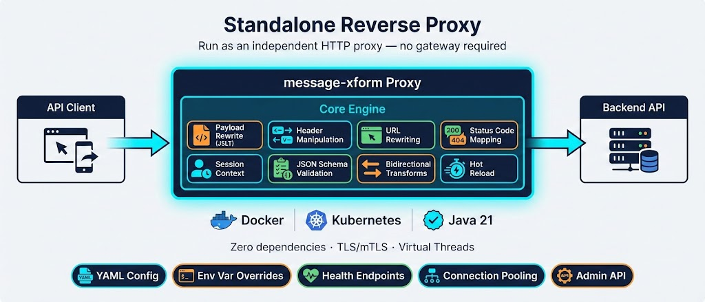
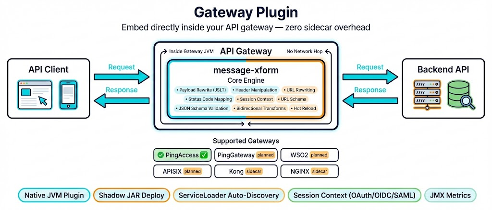

# message-xform

**Declarative HTTP Message Transformation Engine**

Rewrite JSON payloads, manipulate headers, map status codes, rewrite URLs, and access session context — all from YAML configuration, no code changes per API. Transformations work **across layers**: promote a payload field into a header, inject session claims into the request body, derive a URL path from body content, or any combination. Deploy as a **standalone reverse proxy** or embed as a **plugin** in your existing API gateway.

---

## What Can It Transform?

<p align="center">
  
</p>

message-xform operates on **every layer** of an HTTP message:

### 📦 JSON Body Transformation

Restructure, rename, and reshape JSON payloads using [JSLT](https://github.com/schibsted/jslt) expressions — a powerful JSON query and transformation language.

```yaml
# Transform a legacy payload to a modern API format
transform:
  lang: jslt
  expr: |
    {
      "user": {
        "firstName": .legacy.first_name,
        "lastName":  .legacy.last_name,
        "email":     .contact.email
      }
    }
```

### 📋 Header Manipulation

Add, remove, or rename HTTP headers declaratively. Promote payload fields to headers or inject header values into payloads.

```yaml
headers:
  add:
    X-Correlation-ID: "generated-uuid"
  remove:
    - X-Internal-Debug
  rename:
    X-Old-Header: X-New-Header

  # Promote a JSON field to a header
  payload-to-headers:
    - source: "$.auth.token"
      header: "Authorization"
      prefix: "Bearer "
      strip: true   # Remove from payload after promotion
```

### 🔢 Status Code Mapping

Conditionally override HTTP response status codes:

```yaml
status:
  set: 201
  when: '$status == 200 and .created != null'
```

### 🔗 URL Rewriting

Rewrite request paths, query parameters, and HTTP methods — enabling **de-polymorphization** of dispatch-style endpoints:

```yaml
# Convert POST /dispatch?action=delete to DELETE /api/users/{id}
url:
  path:
    expr: '"/api/users/" + string(.resourceId)'
  method:
    set: DELETE
    when: '.action == "delete"'
```

### ↔️ Bidirectional Transforms

Define both request and response transformations in a single spec:

```yaml
transform:
  expr: '{ "name": .legacy_name }'    # Request: legacy → modern
reverse:
  expr: '{ "legacy_name": .name }'    # Response: modern → legacy
```

### 🔐 Session Context Access

Access identity and session data inside JSLT expressions via the `$session` variable — populated from gateway-provided identity attributes (OAuth claims, OIDC session state, SAML assertions):

```yaml
transform:
  lang: jslt
  expr: |
    {
      "user":    $session.sub,
      "email":   $session.email,
      "payload": .
    }
```

---

## Use Cases

- **Legacy API migration** — rename fields, restructure nested objects, and map between old and new schemas without touching backend code
- **API versioning** — transform v1 payloads to v2 format (and back) using bidirectional specs, enabling gradual client migration
- **Polymorphic endpoint rectification** — decompose dispatch-style endpoints (`POST /api?action=delete`) into RESTful resources (`DELETE /api/users/{id}`) via URL rewriting and method mapping
- **Header-based routing enrichment** — promote payload fields to headers (e.g., extract a tenant ID from the body into `X-Tenant-ID`) for downstream routing decisions

---

## Deployment Modes

### 🔀 Standalone Reverse Proxy

<p align="center">
  
</p>

Run message-xform as an **independent HTTP proxy** with zero external dependencies. Ideal for:

- **Development & testing** — validate transforms locally before deploying to a gateway
- **Kubernetes sidecar** — run alongside your backend in the same pod
- **Gateway-free environments** — when you don't need a full API gateway

**Key features:**
- Docker image (~100 MB) with multi-stage build
- Java 21 virtual threads for high-concurrency request handling
- TLS termination (inbound + outbound) with mTLS support
- Environment variable overrides for all configuration
- Health (`/health`) and readiness (`/ready`) endpoints
- Hot reload via file watcher + admin API (`POST /admin/reload`)
- Connection pooling with configurable timeouts

```bash
# Quick start with Docker
docker run -v ./specs:/specs -v ./config.yaml:/config.yaml \
  -p 8080:8080 message-xform-proxy

# Or run directly with Java 21
java -jar message-xform-proxy.jar
```

### 🔌 Gateway Plugin

<p align="center">
  
</p>

Embed message-xform **directly into your existing API gateway** as a native plugin, rule, or filter. The core engine runs inside the gateway's JVM — no network hop, no sidecar overhead.

**Supported gateways:**

| Gateway | Integration Model | Status |
|---------|-------------------|--------|
| **Standalone Proxy** | Embedded HTTP proxy (Javalin/Jetty) | ✅ Complete |
| **PingAccess** | Java plugin via `AsyncRuleInterceptor` SPI | ✅ Complete |
| **PingGateway** | Java/Groovy filter chain | 🔲 Planned |
| **WSO2 API Manager** | Java extension API | 🔲 Planned |
| **Apache APISIX** | Java Plugin Runner | 🔲 Planned |
| **Kong** | Sidecar proxy (Lua ecosystem) | 🔲 Planned |
| **NGINX** | Sidecar proxy (njs/C ecosystem) | 🔲 Planned |

> Gateways with a **Java runtime** support direct JVM integration — the core engine runs natively inside the gateway.
> Non-Java gateways use a **sidecar pattern** — the standalone proxy runs alongside the gateway, which proxies through it.

---

## Configuration

Transforms are defined in **YAML spec files** — one per transformation — and bound to URL patterns via **profiles**:

```yaml
# specs/user-transform.yaml — the transformation logic
id: user-transform
version: 1.0.0
input:
  schema: { type: object }
output:
  schema: { type: object }
transform:
  lang: jslt
  expr: '{ "user": { "name": .legacy.name } }'
headers:
  add:
    X-Transformed: "true"
```

```yaml
# profile.yaml — binds specs to routes
profile: my-api
transforms:
  - spec: user-transform@1.0.0
    match:
      path: /api/v1/users/**
      method: [POST, PUT]
      content-type: application/json
    direction: request
```

**Key design principles:**

- **Specs are portable** — pure transformation logic, no gateway knowledge
- **Profiles are deployment-specific** — bind specs to URL patterns per environment
- **Version pinning** — reference specs by `id@version` for safe concurrent upgrades
- **Hot reload** — update specs without restarting the proxy or gateway

---

## Quick Start

### Prerequisites

- **Java 21** (for building from source)
- **Docker** (for containerized deployment)

### Build from Source

```bash
git clone https://github.com/ivanstambuk/message-xform.git
cd message-xform

# Run the full quality gate (format + compile + test)
./gradlew --no-daemon spotlessApply check

# Build the standalone proxy shadow JAR
./gradlew --no-daemon :adapter-standalone:shadowJar

# Build the PingAccess adapter shadow JAR
./gradlew --no-daemon :adapter-pingaccess:shadowJar

# Build the Docker image (~100 MB)
docker build -t message-xform-proxy adapter-standalone/
```

### Run the Standalone Proxy

```bash
# With Docker
docker run \
  -v ./my-specs:/specs \
  -v ./my-profile.yaml:/profile.yaml \
  -e MXFORM_BACKEND_HOST=api.example.com \
  -e MXFORM_BACKEND_PORT=443 \
  -e MXFORM_BACKEND_TLS_ENABLED=true \
  -p 8080:8080 \
  message-xform-proxy

# Or directly with Java
java -jar adapter-standalone/build/libs/adapter-standalone-*-all.jar
```

### Deploy the PingAccess Plugin

```bash
# Build the shadow JAR
./gradlew :adapter-pingaccess:shadowJar

# Copy to PingAccess deploy directory
cp adapter-pingaccess/build/libs/adapter-pingaccess-*-all.jar \
   /opt/pingaccess/deploy/

# Restart PingAccess — the plugin auto-registers via ServiceLoader
```

---

## Tech Stack

| Component | Technology |
|-----------|------------|
| Language | Java 21 (virtual threads) |
| Build | Gradle 9.2 (Kotlin DSL) |
| HTTP Server | Javalin 6 / Jetty 12 |
| JSON Processing | Jackson 2.17 |
| Transform Language | [JSLT](https://github.com/schibsted/jslt) (pluggable SPI) |
| Schema Validation | networknt json-schema-validator |
| Testing | JUnit 5, AssertJ, Karate |
| E2E Testing | [Karate](https://karatelabs.github.io/karate/) + Docker Compose |
| Formatting | Palantir Java Format (via Spotless) |
| CI | GitHub Actions |

---

## PingAccess Adapter

The PingAccess adapter embeds the transformation engine as a native **RuleInterceptor** plugin:

- **AsyncRuleInterceptor** SPI — non-blocking request + response interception (Site rules only)
- **Bidirectional transforms** — request and response in a single spec
- **Session context** — OAuth claims, OIDC attributes, and SAML assertions available as `$session` in JSLT
- **Profile routing** — multiple specs bound to URL patterns per PA Application/Resource
- **Hot reload** — file-based spec reloading without PA restart
- **JMX metrics** — active spec count, transform counts, error rates (opt-in via plugin config)
- **Shadow JAR** — single deployable JAR with relocated dependencies; uses PA-provided Jackson/SLF4J
- **Tested against PA 9.0.1** — 31 E2E scenarios validated via Karate + Docker Compose

---

## License

Licensed under the [Apache License 2.0](LICENSE).

---

<p align="center">
  <sub>Built with ☕ Java 21 · Declarative YAML · Zero-dependency core</sub>
</p>
